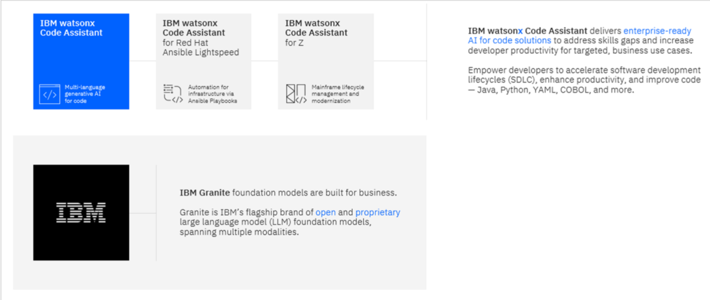

# Introduction : WatsonX Code Assistant

IBM watsonx Code Assistant (WCA) is an enterprise-grade coding assistant that is designed to accelerate software development and application modernization. It integrates generative AI and automation capabilities that can help simplify and streamline coding workflows across Python, Java, C, C++, Go,JavaScript, TypeScript and more.

WCA is tailored to boost productivity and lower skills barriers, enabling development teams to spend more time on innovation.

WCA is the flagship offering in a suite of purpose-built, generative AI-assisted code assistant products that are built to accelerate code and content generation and increase developer productivity with trust, security, and compliance at its core. 

This portfolio also includes offerings for Ansible Automation Platform 
(IBM watsonx Code Assistant for Red Hat Ansible Lightspeed) and IBM Systems modernization 
(IBM watsonx Code Assistant for Z).

WCA accelerates software development tasks with AI-powered capabilities including context-aware code generation, explanation, documentation, translation, and unit test generation. 

WCA also features advanced capabilities in the analysis and modernization of enterprise Java applications with a guided experience that supports the end-to-end application lifecycle.

WCA leverages Granite models to augment programmer skill sets, simplifying and automating coding and modernization efforts. Granite is IBM’s family of open, performant, and trusted AI models, tailored for business and optimized to scale enterprise AI applications. 

In WCA, these AI models, and the recommendations they generate, are seamlessly integrated via extensions with widely used integrated development environments (IDEs), including Visual Studio Code (VS Code) and Eclipse.

WCA is available as software-as-a-service (SaaS) on IBM Cloud and also as software for on-premises deployments. 

Note that user-submitted code does not get stored by IBM. Code is sent to WCA and is used as part of model prompts, but these prompts and the returned responses are ephemeral.

### 1. About this Lab
The main objective of this lab is to provide hands-on experience with some of the core features and capabilities available to developers in IBM watsonx Code Assistant (WCA).

The lab content is loosely organized to align with the capabilities found in the two different plans (editions) available for WCA:

### 1.1 Essentials:
-  Generating code
-  Explaining code
-  Creating unit tests
-  Documenting code

### 1.2 Standard
In addition to all the capabilities found in the Essentials plan, the Standard plan also includes these enterprise Java modernization capabilities:

- Java upgrades, regardless of runtime
- WebSphere to Liberty transformation
- Enhanced test generation and code explanation

After completing this lab, you will have a deeper understanding of what is possible with WCA and will have observed how it can be a powerful tool to help accelerate software development and application modernization.
