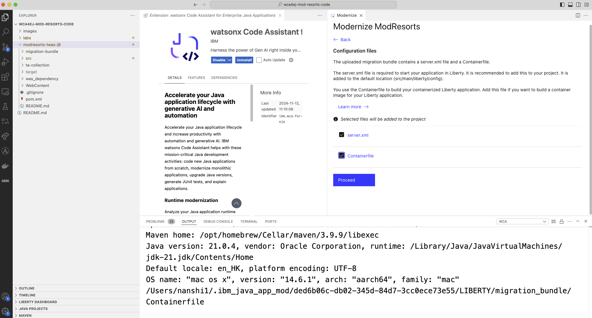
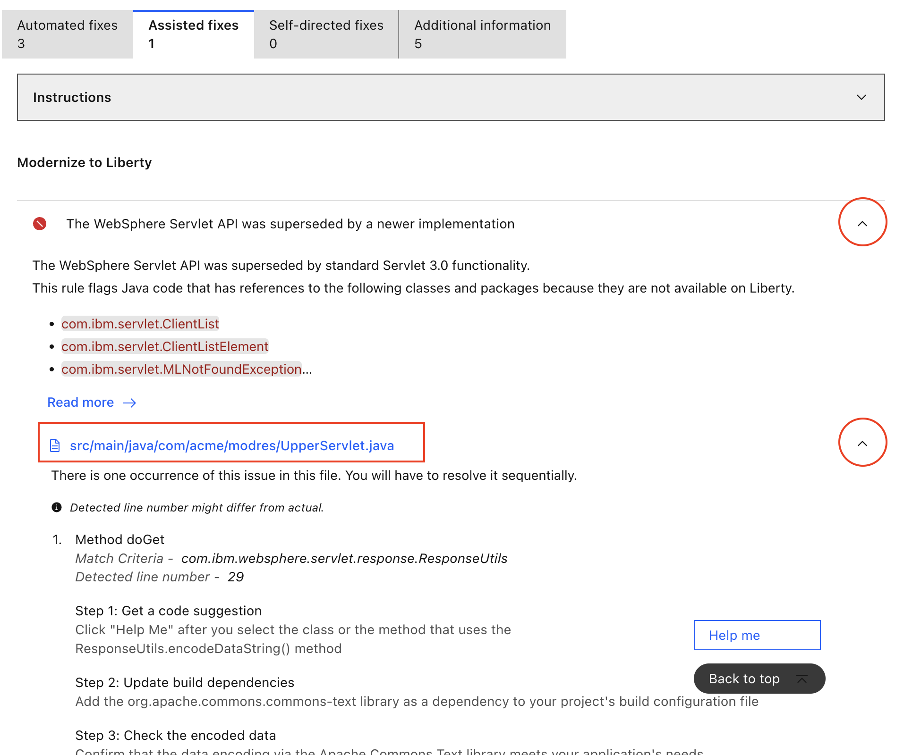
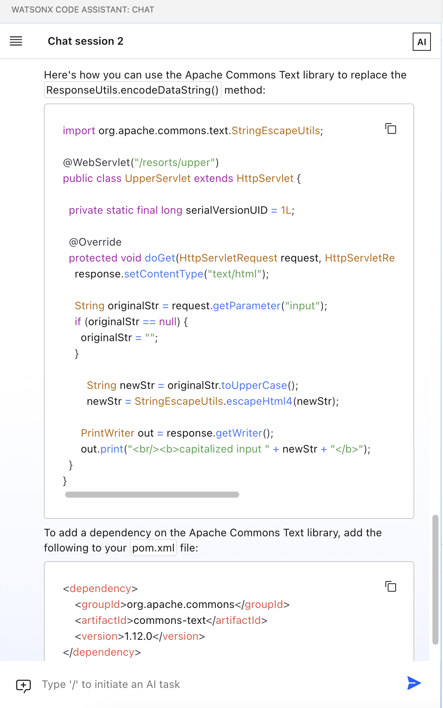

# Lab2: Code Modernization

WCA also helps organizations to modernize their enterprise Java applications by combining generative AI with advanced automation.
WCA helps architects and developers to understand their environment, plan their modernization approach, and transform their code with the help of generative AI.
WCA can then help to validate new code with generated test cases and deploy the modernized applications with automated
processes. These capabilities are included as part of the WCA Standard plan.

This document gives step-by-step guide to finish Lab2.

## Lab2 covers:

- Modernize code from WebSphere to Liberty

### 1. Application analysis

Right click on the `modresorts-twas-j8` folder and select `watsonx Code Assistant` - `Modernize to Liberty`.

A `Modernize` tab will show up. Click `Upload migration bundle`, and select the file in our code asset `modresorts-twas-j8/migration-bundle/modresorts.ear_migrationBundle.zip`

**Note:** The uploaded migration bundle contains a server.xml file, which is required to start the application in Liberty. By default, it is selected to be added to your project.

Select both files to be included and `Proceed`.

WCA helps identify compatibility issues, deprecated features, and configuration differences between WebSphere and Liberty.
After analysis, the report will show you issues with this application to be fixed. 3 of them can be automated, 1 of them needs assistance. For the automated fixes, we click `Run automated fixes`.

**Note:**
An automated fix is a code change that WCA can apply automatically to resolve an issue, without manual user intervention.

An assisted fix is used when an issue detected by WCA does not have a recipe-based automated fix for it. For this type of fix, when the user requests help, a custom prompt calls a large language model (LLM) to provide guidance back to the user on how to fix the issue.

### 2. Apply Fixes

For the assisted fixes, you can click the `Instructions` dropdown to see the step which we will guide you. Now we expand the dropdowns of the issue as shown. There are clear instructions on how to fix this issue at the bottom.

Now we click the name of the file that has issue and needs to be fixed. In the editor window, we select the entire class defined in here that uses the `ResponseUtils.encodeDataString()` method by highlighting. Then we click `Help me` to ask help from LLM.

The chat with model window will show up and ask model for help. The model gives suggestions for fixing the issue.

There are 2 action items here.

- First need to change the code in the `UpperServlet.java` file using the copy code from chat.
- Second need to update `pom.xml` to reflect the dependency.

**note**: Don't forget to save your modified files after the copy/paste.  
**Tip:** To save the file, press `Ctrl + s` (on Windows) or `Command + s` (on Mac). Alternatively, select `File > Save` in the main menu bar.

### 3. Rebuild Application

Now that we have all the fixes applied. If your `modresort` application is still running, please stop it by going to `TERMINAL` and `CTRL+C`. You can `Rebuild and refresh` to see that there are no more issues with the application.

You can then restart the `modresorts` application from the `LIBERTY DASHBOARD`section and go to the browser to view the new application. This time you will find that the `Logout` button is fixed.

