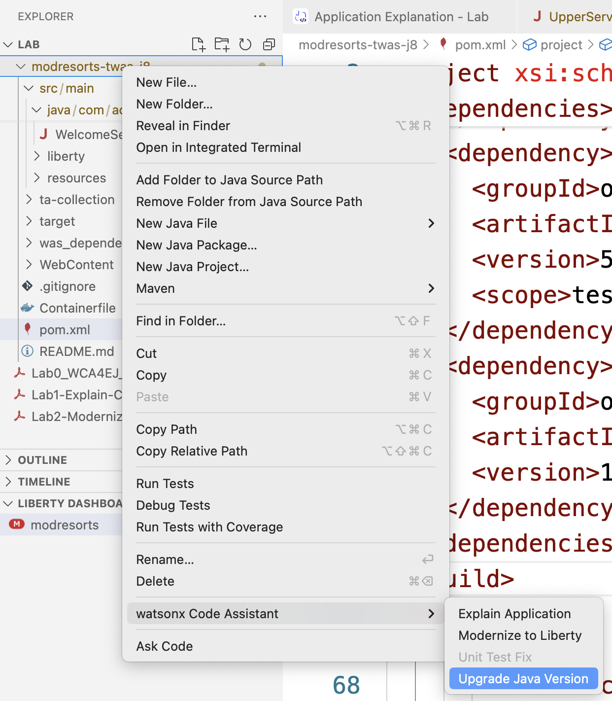
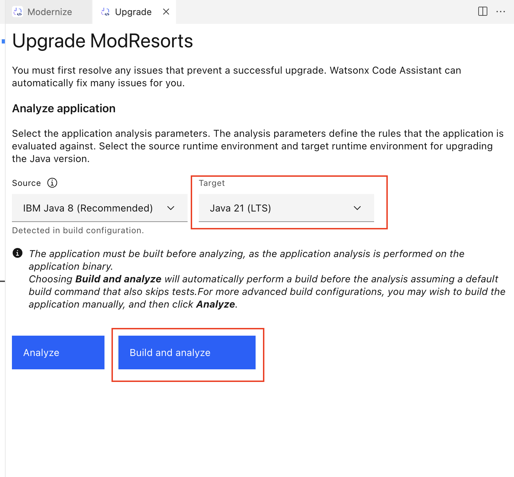
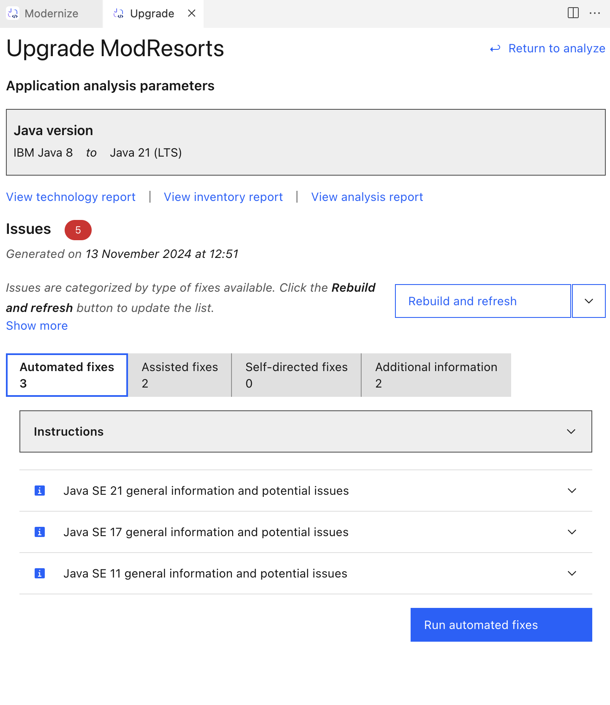
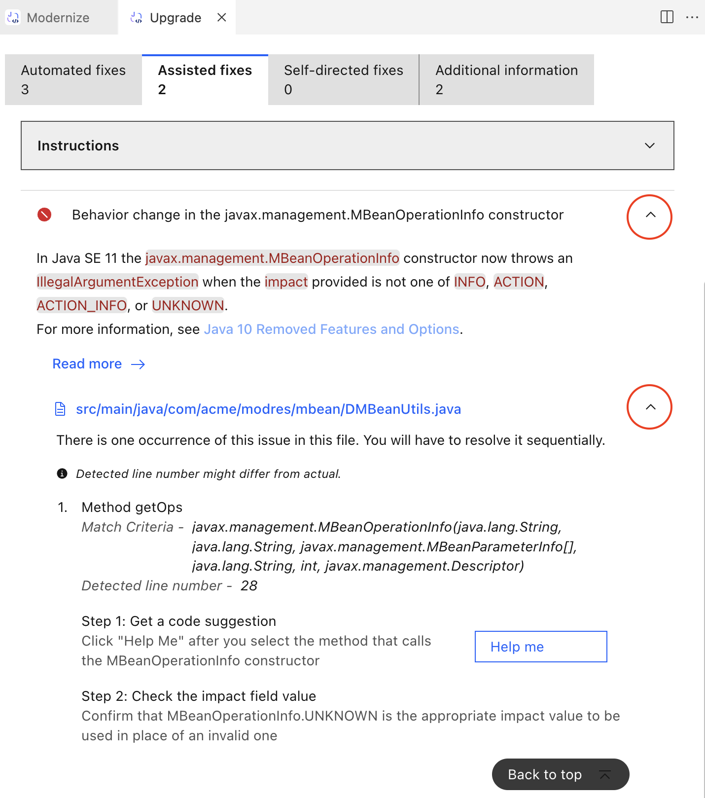
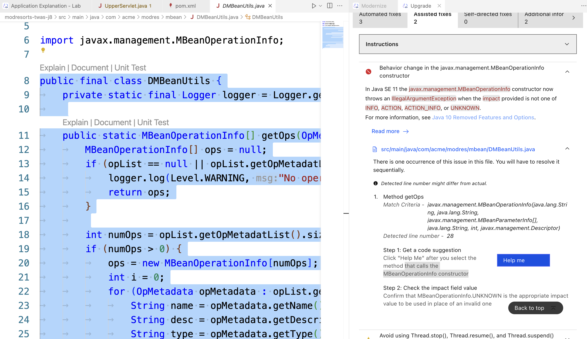
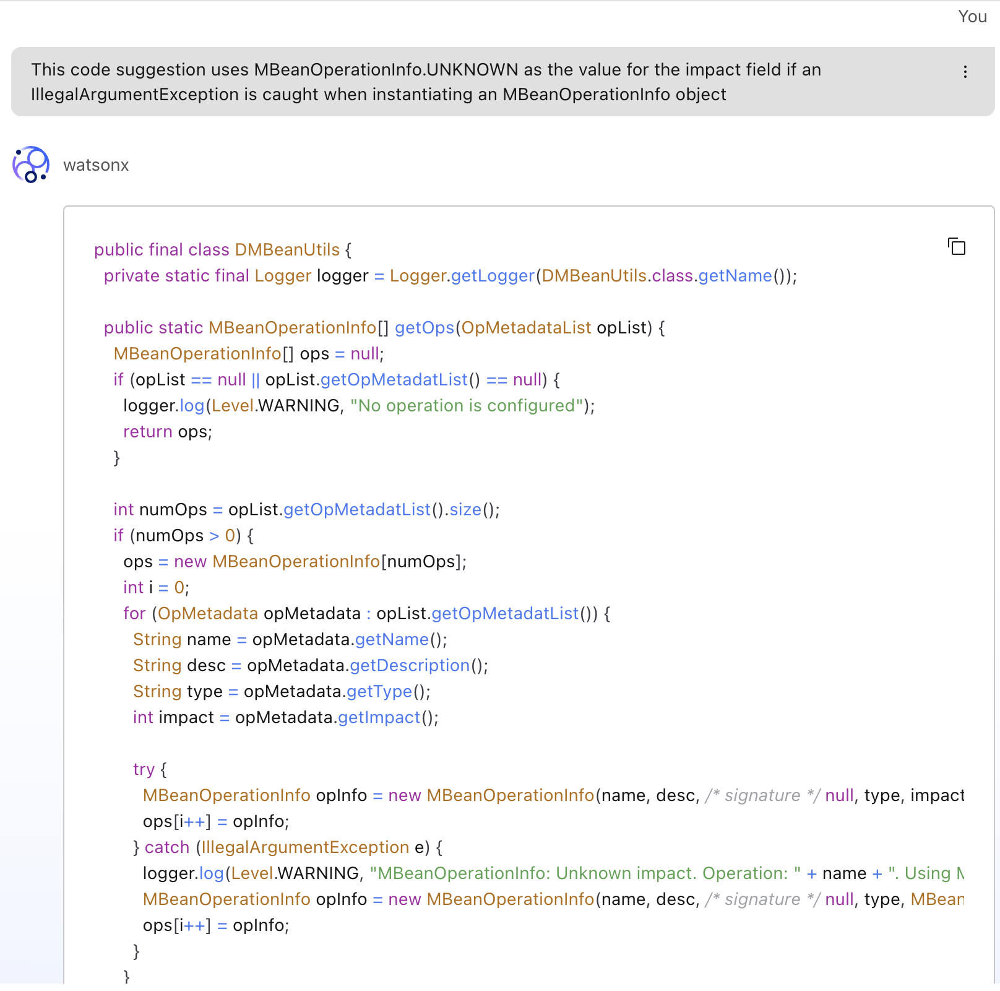
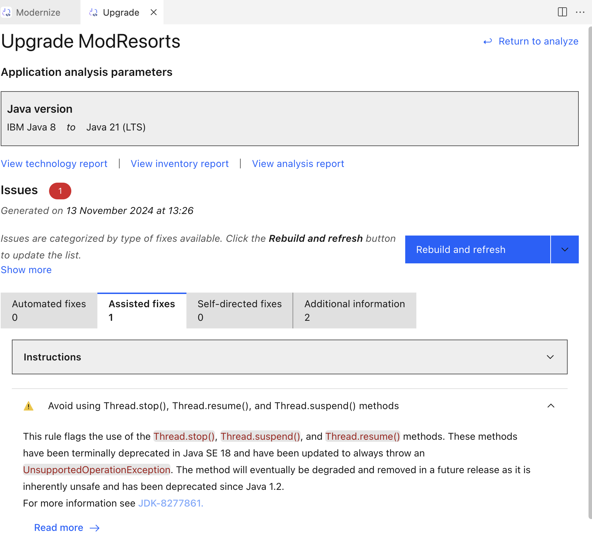

# Lab3: Upgrade Java Version

Another key use case for WCA is Java code upgrades. WCA helps organizations keep pace with the latest version of Java, capitalizing on AI to identify gaps and automatically apply the fixes needed to update their codebase.

This document gives step-by-step guide to finish Lab3. You will find the steps very similar to Lab2.

## Lab3 covers:

- Upgrade from Java8 to Java21

### 1. Application analysis

Right click on the `modresorts-twas-j8` folder and select `watsonx Code Assistant` - `Upgrade Java Version`.

A `Upgrade` tab will show up. In the `Target` dropdown, select`Java 21 (LTS)`, and then click `Build and analyze`.

**Note:** Close any other windows that might be open in the file editor space – just to use the full screen. But keep the Upgrade Java Version window open.

After analysis, the report will show you issues with this application to be fixed. 3 of them can be automated, 2 of them needs assistance. For the automated fixes, we click `Run automated fixes` (this process might take long).

### 2. Apply Fixes

For the assisted fixes, you can click the `Instructions` dropdown to see the step which we will guide you. Now we expand the dropdowns of the first issue as shown. There are clear instructions on how to fix this issue at the bottom.

Now we click the name of the file that has issue and needs to be fixed. In the editor window, we select the entire class defined in here that that calls the `MBeanOperationInfo` constructor by highlighting. Then we click `Help me` to ask help from LLM.

The chat with model window will show up and ask model for help. The model gives suggestions for fixing the issue.
Delete all of the existing code from the DMBeanUtils.java file and paste the newly generated code into it (i.e. replace all of the existing code with the new code).

Here we change the code in the `DMbeanUtils.java` file using the copy code from chat. Save your changes to the `DMbeanUtils.java` file (if you don’t save the changes then WCA won’t see them when it rebuilds the application later). Then, close the file, as you don’t need it open any longer.

**Tip:** To save the file, press `Ctrl + s` (on Windows) or `Command + s` (on Mac). Alternatively, select `File > Save` in the main menu bar.

We can ignore the second issue for now as it is a deprecation warning. Or if the rebuild still have error, you can go through the same process and fix the warning as well.

### 3. Rebuild Application

Now that we have all the fixes applied, we can `Rebuild and refresh` to see that there are no more critical issues with the application.

You can then restart the `modresorts` application from the `LIBERTY DASHBOARD`section and go to your browser to view the new application. This time you will find that the location module is fixed.

The application has been successfully upgraded from Java 8 to Java 21 – after already having been migrated from WebSphere Application Server to Liberty.

**Note:** You could have actually done the migration and the Java upgrade at the same time, but for learning purposes they were done separately here.

Reflect on what WCA was able to do here and there was a set of issues that WCA was able to handle automatically and another set for which it guided you through the resolution. The time and effort savings should be very evident.
