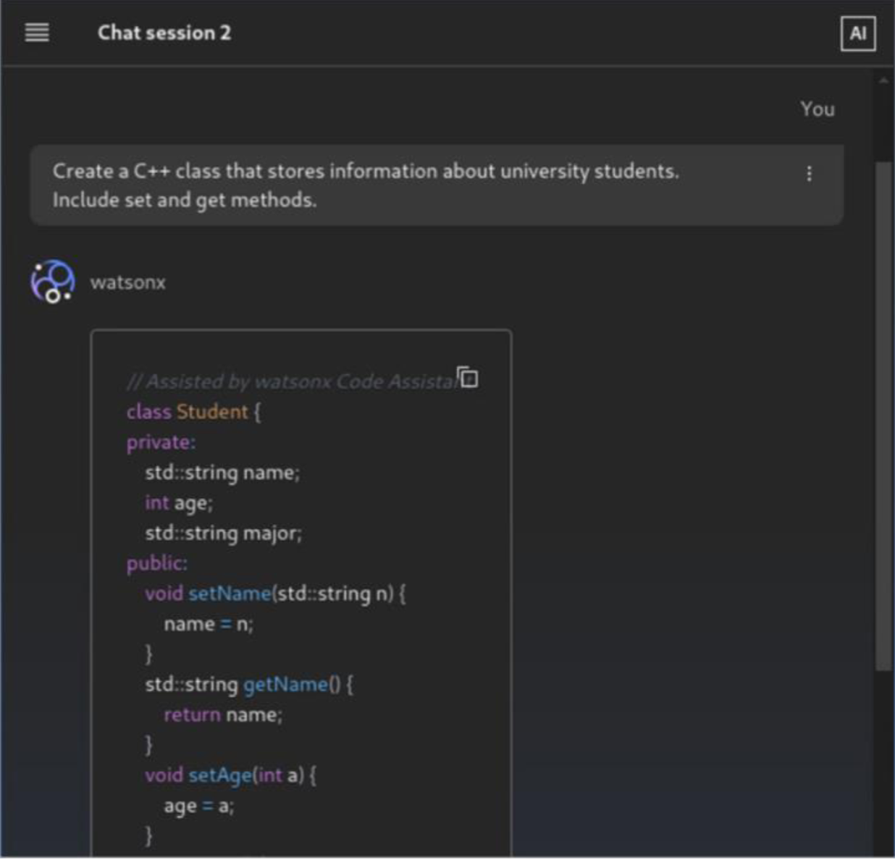
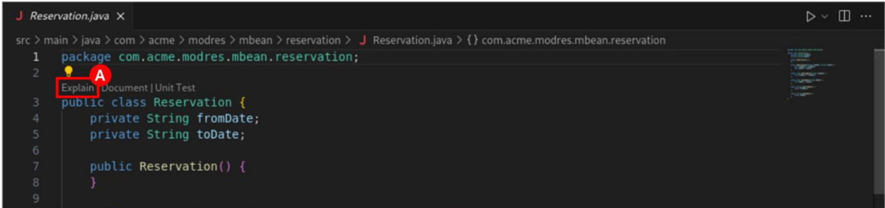

# Global Lab5

This document gives step-by-step guide to finish Lab5, but feel to add in a few of your own attempts.

# Lab5: Accelerating software development with WCA

Developers have multiple ways of leveraging WCA’s real-time code assistance. One way is through the
chat interface, in which developers can use chat sessions to submit natural language prompts that
describe the results they want to receive.
Developers can also initiate in-context requests directly from within the source code editor, including the ability to leverage code completion to generate new code.
All of the features and capabilities shown in this section are available with the WCA Essentials plan which means they’re available in the Standard plan as well.

In fact, WCA lets developers take advantage of generative AI while working in their existing code.
In this section you will see some of these capabilities in action.

## Lab5 covers:

- General programming with other languages, including
  - chat interface
  - code auto completion
  - code explanation
  - code documentation
  - unit test generation
  - code translation

> **Note:** To help you get started, we've provided some sample code in the `lab5-sample-code` folder.

### 1. WCA Chat interface

The WCA chat interface allows developers to use natural language prompts to perform development
tasks. For example, you can ask WCA to generate a function that performs a specific task in a particular programming language. Or you could ask WCA for an example of how to call a particular API (application programming interface). The possibilities are endless.

When a user enters a prompt in the chat, WCA isn’t simply just passing that request to the underlying foundation model and returning the results as-is. In fact, WCA performs unique pre-processing and post-processing activities to improve the relevance and usefulness of the results. For example, depending on the scenario, WCA can perform code similarity checks to see if generated code is similar to code used in the training of the Granite model. A code suggestion might then be blocked, displayed with a warning, or displayed as-is.

In this section, you will be introduced to the basics of the chat interface, along with some simple code generation, documentation, and explanation examples.

-- open the WCA chat window in Visual Studio Code


-- Note the following features of the chat window


- A. Prompt area: Users enter their prompt requests here.
- B. Submit: Sends the prompt request to WCA.
- C. Prompt results and conversation history: Results from a request are displayed here
- D. Start new chat session: Begin a new chat session, independently of existing ones.
- E. Chat session identifier: Displays the name of the current chat session.
- F. Open menu: Includes a prompt library and chat session management.

Let’s start with a simple example. You are a Java developer, and you need to write some code that does an equality check between two strings using the equalsIgnoreCase( ) method. However, the
documentation you have read was not very clear and you are not exactly sure how to use that method.

Type the following text into the chat window and then hit <Enter> (alternatively, you can click the
Submit icon). You can copy and paste the following example:

```bash
    Show me an example of how to call the equalsIgnoreCase method in java
```


**Note:** What is included in the response depends on the prompt provided, but this particular example (which might or might not match what you see) includes the following elements:

- A. -The WCA response, which might include things like a summary of what has been requested, generated code/output, and an explanation of the code.
- B. -A copy icon to easily copy the generated code from the chat into the clipboard.
- C. -“Thumbs up” and “thumbs down” icons to provide feedback on the quality of the generated response. This feedback is reviewed by the WCA team and is used to generate new data sets to train the next generation of models. Your feedback is important!


**Note:** Looking at the response itself, it includes exactly what was requested. In fact, if you had not already known what function to use in the first place, perhaps you could have instead asked WCA something like, “What function can I call in Java to do a case insensitive equality check of two strings? Show me an example of how to call it.”

Here’s another simple example. You are a developer working on a project for a university admissions
office, writing a C++ application to manage student information and course registrations. As a starting point, you want to focus on the student data model.
First, though, you need to start a new chat session. Why do you need to do this? A WCA chat employs a conversational “back and forth” approach that iteratively builds off the previous work done in the chat.
Simply put, when a new prompt is sent to WCA, the chat conversation history is automatically included with it as context. Therefore, if you are wanting to explore something different from what you have been doing in the current chat – as is the case here, since it’s unrelated to the previous example – you should start a new, empty chat session.

-- Click the Start new chat session icon (A) in the lower left corner of the WCA chat window.


-- Enter the following text into the chat window.

```bash
Create a C++ class that stores information about university students.
Include set and get methods.
```

The output appears to match what was requested. In reality, there is a lot of different information that you would want to store for a student but it’s a good starting point.



Let’s try a more elaborate example. Your intended task in this example is to create C functions for
dynamically allocating and deallocating a numeric array.

**Note:** Again, this is unrelated to the previous work you did and so you need to start a new chat session.

- Click the Start new chat session icon (A) in the lower left corner of the WCA chat window.


As a first step, you decide to start with a single task – a function to allocate the array. You believe that you are going to be dealing with an array of integers and so your first prompt will state that.

- Enter the following text into the chat window and submit it.

```bash
   Write a simple C function that just allocates an array of integers of a given size and returns a pointer to it
```

Code is generated for the function. Looking at the code, it seems to do what was requested.


You take a closer look at the specifications you were given and realize that the numeric values you will be dealing with are actually using the float data type.

- Enter the following text into the chat window and submit it.

```bash
Instead of an int array, use a float array
```

The function has been changed to allocate an array of float values and return a float pointer. Note how you didn’t have to start from the beginning, nor did you have to include the previously generated code.

WCA remembers what has been done already and the previously generated code was included as
context with this last prompt.


The code looks like it would work well for “happy path” scenarios where a valid array size is specified, but the code really should safeguard against invalid input.

- Enter the following text into the chat window and submit it.

```bash
  Add a check for a valid array size greater than 0. Also, define a
constant called MAX_ARRAY_SIZE of 1000 and add an error check for size
greater than it.
```

The requested parameter checks have been added. Again, WCA remembered the previous code that
had been generated and it did not need to be explicitly provided.


Thinking more about error handling, you realize that you shouldn’t assume that memory allocation will
always succeed. Also, the function is more useful to callers if they can expect the array to be cleared (zeroed out) versus each caller having to do it themselves.

- Enter the following text into the chat window and submit it.

```bash
  Validate that the memory could be allocated successfully and return a
null pointer for any type of error. Also, after allocating the array
memory, clear it.
```

The requested changes have been included in the generated output.


You decide that the for-loop used to clear the memory for the array is not very efficient when dealing with large arrays and it’s more efficient to use the C memset( ) function instead.

- Enter the following text into the chat window and submit it.

```bash
  Clear the array memory using memset instead of the for loop.
```

The generated code has been changed accordingly.


With the allocation function complete, you now want to create another function that consumers can
call to free the array’s memory when it’s no longer needed.

- Enter the following text into the chat window and submit it.

```bash
  Add a corresponding deallocate function to this code and check to make
sure the pointer isn’t null before freeing it
```

The generated code includes all of the previous code plus the new function (surrounding code not
shown here).


As a final step, you want to document the code and add a header comment for each function. As a example, your team uses Doxygen-style comments as their standard.

- Enter the following text into the chat window and submit it.

```bash
  Add doxygen style comments before each function
```

Comments have been added to the code. Here is one example of it:


**Note:** Continue trying other sample prompts from the Prompt Library. Also spend some time trying out your own prompts. Alternatively, here are some other examples to try.
(Remember to start a new chat session before each one!)

Sample #1:

```bash
Write a java function that combines three input lists (of varying
lengths) by alternatingly taking elements from each list. Stop after hitting the end of the shortest list.
```

Sample #2:

```bash
Translate this C function to Python: int addNums(int num1, int num2) {
int sum = num1 + num2; return(sum); }
```

Sample #3:

```bash
Write a python script that connects to a Db2 database with a user-
provided server, port, username, and password.
```

Sample #4:

```bash
Generate code for calling a GET endpoint with axios from a React App.
```

Sample #5:

```bash
Write a create table sql statement for a table that will store employee records. Each employee ID should be unique.
```

Sample #6:

```bash
Write a golang function that shows all prime numbers less than a number provided by the caller.
```

### 2. Code Auto Completion

When developers write code, WCA will provide real-time inline suggestions. WCA can autocomplete a line of code as you type. The process for this is to start typing a line of code, wait for 1 second, and a suggestion for the remaining code for that line will be displayed. You are then able to accept the suggestion (by pressing the Tab key), reject it (by pressing the Esc key), or you can simply continue typing


The other example used here build off of the same piece of code.

1. Start a new chat session.
2. Create a new Java source file. Select File (A) from the main menu bar and then select New File (B).


3. Select New Java File (A)


4. The file needs to be saved before WCA can work with it. Select File (A) from the main menu bar and then select Save As (B).


5. Select Documents (A) for the save folder, enter wca_cc.java for the file name, and then click the Save button (C).


6. Delete any code that might have been automatically inserted into the file editor and insert the
   following code instead (such that this is the only code in the file).

```bash
public class User {
  private String name;
  private int userId;
}
```

The code might paste as a single line. Adjust the indentation so that it matches the image below. Also, if an extra curly bracket is added to the end of the class (it will be red in color), remove it.


7. WCA can autocomplete a line of code as you type. The process for this is to start typing a line of code, wait for 1 second, and a suggestion for the remaining code for that line will be displayed. You are then able to accept the suggestion (by pressing the Tab key), reject it (by pressing the Esc key), or you can simply continue typing. You will try this next.

On line 5, following the two existing private member variables, press the Tab key to line up your new
line with the existing members and then type private (A).


About one second after typing WCA displays a code completion suggestion. Given that the previous
line includes a user ID variable, there’s a good chance that WCA suggests a password to you.


8. Press the Tab key to accept this suggestion.

After the suggestion has been accepted, it is added to the code:


WCA can also generate a larger, multi-line block of code. Do not do this right now, but it is done by starting
to a line of code and then pressing Alt + . (period) on Windows or Option + . (period) on Mac (to be clear,
this means pressing the Alt or Option key and then while keeping it pressed, press the period key). WCA
will complete the current line and add additional code lines. As in the case of single-line completion, you
can then accept the suggestion by pressing the Tab key.

You will try this now. On line 6 (following the line you just added), add a new empty line and press the Tab key to line up your new line with the existing class members. Then type public (A)


9. WCA suggests a single-line completion. Press the Esc key to dismiss it.

**NOTE:**
Initiate a multi-line completion request by pressing Alt + .on Windows or Option + . on Mac
You might simply see a suggestion for the class constructor, but you might also see multiple methods suggested as well


10. Press the Tab key to accept this suggestion.
    Once the suggestion has been accepted, it is added to the code.


11. Try this one more time. Go to the end of the class definition and insert a blank line prior to the end of the class (such that you are still positioned within the class). Initiate a multi-line completion request by pressing Alt + . on Windows or Option + . on Mac.

What has it suggested? Does it look useful? Choose to dismiss it or accept it.

**NOTE:**
WCA can also generate source code based on code comments you enter. This is done by entering a
comment and then typing Alt + . on Windows or Option + . on Mac. WCA will generate code that
implements what the comment says. As with the other examples of code completion earlier, if you are satisfied with the suggestion, you press the Tab key to accept it. Otherwise, you can dismiss it by pressing the Esc key.

When generating code from comments in the editor, the best practice is to write the comment as a regular comment. Do not write your comment in the form of an instruction. The model has been trained on many typical comments and the closer your comment is to a typical comment, the better the results should be.

```bash
For example, do not write your comments like this:

// Write a method that returns even numbers from an arraylist

Instead, one of these examples would likely provide better results.

// Return even numbers from an arraylist.
// Method that returns even numbers from an arraylist
```

12. Go to the end of the class definition and insert a blank line prior to the end of the class (such that you are still positioned within the class). Enter the following text (A):

```bash
//Sort an array of Users by userId.
```


13. Press Alt + . on Windows or Option + . on Mac.
    A method that implements the comment you just entered is suggested. It may be a complete
    function, or it may just include the “skeleton” of the function. What you experience might vary.


**Note:** It is likely that the code will not compile and run as-is. For example, you might have to import classes/packages related to code that has been added (for instance, the Arrays class, in this example).

14. Close the wca_cc.java file. You will no longer use this file, so feel free to save your changes or close without saving.

### 3. Code Explanation

WCA can help explain the details and functions defined in the code sample.All aspects of this code have been described in natural, English language.

1. Open a new chat session.
2. Click the Explorer icon (A) at the top of the left-side Activity bar


3. The EXPLORER panel opens. A sample application – ModResorts – has been included in the lab
   environment. In the source code navigation tree, expand src / main (A) > java / com / acme / modres
   (B) > mbean (C) > reservation (D). Then select the Reservation.java file (E).


The Reservation.java file opens in the file editor on the right.
Note that, prior to the class and methods, there is a header that has been inserted by WCA (this is just a part of the file editor interface and has not been inserted into the code itself). This provides a quick and easy way to ask WCA to explain the code, document the code, and generate unit tests for the code.


4. Start by asking WCA to explain the code in the Reservation class. Click Explain (A) in the header above this class (above line 3).



\*\* Note: If a prompt appears asking to analyze the application, click Proceed without analysis to skip this. It is fine if you do not see this prompt.

The WCA chat window opens and an “/explain Reservation” prompt is automatically entered.
In response, WCA explains the code in the Reservation class. Review the response.


Tip: You just saw how WCA entered “/explain Reservation” into the chat window. You are also able to
enter commands like this yourself directly into the chat window. Commands include /help, /explain,
/document, /translate, and /unit-test.

References to files, classes, and methods from the workspace can be included on these commands.

Let’s look at a different file to see an additional way to explain code.

1. Start a new chat session in WCA’s chat window
2. Click the Explorer icon at the top of the left-side Activity bar to open the EXPLORER panel.
3. In the source code navigation tree, expand src / main and then expand java / com / acme / modres.
   Then select AvailabilityCheckerServlet.java, which should open the file in the editor.

**NOTE:** Previously, you saw how you could explain all of the code for a class or method by clicking the Explain option inlined by WCA into the source code above the object. However, there might be times when you want to explain a specific excerpt of the code and not the entire method, or perhaps explain multiple methods together.

1. Using your mouse or keyboard, select the code in lines 50-55.


1. Right-click somewhere within the selected text (A). This will open a menu. Select watsonx Code
   Assistant (B) and then select Explain This (C).


The chat window opens, and a prompt is automatically entered that asks for the code you selected to be explained.

  

An explanation is given.


Close the AvailabilityCheckerServlet.java file by clicking the X (A) in the tab at the top of the screen.


**NOTE:**
As you can see, you have different ways of interacting with WCA and performing actions such as code explanation, code documentation, and unit test generation.

### 4. Code Documentation

As you can see, there are no comments for the code in this class. Ask WCA to generate comments by
clicking Document (A) in the header above the Reservation class (above line 3).


**Note:** If a prompt appears asking to analyze the application, click Proceed without analysis to skip this. It is fine if you do not see this prompt.

A “/document Reservation” prompt is automatically entered into the chat window and in response
WCA provides an augmented version of the code that includes comments. Review the output. In
practice, you can selectively choose to copy portions of the output or the output as a whole and use it in your source code.


**Note:** Depending on the code in question, you might see function/method header documentation
generated and you might also see comments added to the source code itself explaining what various
statements or blocks of statements are doing.

### 5. Unit test generation

WCA can also help you generate unit tests (test cases). Generally, you would probably do this at the individual function/method level, but just as an example, click Unit Test (A) in the header above the Reservation class (above line 3).

**Note:** Similar to what we see for Java, unit test generation is available for other languages.
Don't forget the `@` symbol to refer to a file.


**Note:**
If a prompt appears asking to analyze the application, click Proceed without analysis to skip
this. It is fine if you do not see this prompt.
WCA provides unit test code and accompanying details. Review the output.


Close the Reservation.java file by clicking the X (A) in the tab at the top of the screen.


### 6. Code Translation

Code translation is provided via the following syntax:

```
/translate from SOURCE_LANGUAGE to TARGET_LANGUAGE @REFERENCE_FILE|CODE_SNIPPET
```

> **Note:** You might want to start a new chat session for this command.

Please note from SOURCE_LANGUAGE is an optional argument, and can be skipped while doing translation.

For this lab, we will conver the python palindrom code to go language. Try the following prompt:

```
/translate from python to go @UseCase_Code_Palindrome.py
```


